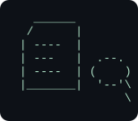
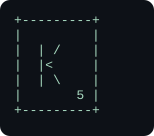
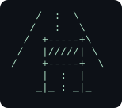

<!-- Artwork is editable SVG made from monospaced text. Keep the assets folder beside this README. -->

<p align="center">
  
</p>

### `$ ls selected-work/`

<table>
  <tr>
    <td width="154"></td>
    <td>
      <strong>[01] <a href="https://github.com/zabrodsk/proof">PROOF</a></strong><br>
      Claims checked against source evidence.<br><br>
      <a href="https://app-proof.up.railway.app/">Open app ↗</a> · <a href="https://github.com/zabrodsk/proof">Source ↗</a>
    </td>
  </tr>
  <tr>
    <td></td>
    <td>
      <strong>[02] <a href="https://kris-kros.cz/">KRIS KROS</a></strong><br>
      A Czech multiplayer word game.<br><br>
      <a href="https://kris-kros.cz/">Play ↗</a>
    </td>
  </tr>
  <tr>
    <td></td>
    <td>
      <strong>[03] <a href="https://github.com/zabrodsk/UzavirkaAI">UZAVÍRKA.AI</a></strong><br>
      A road-closure planning prototype for municipalities.<br><br>
      <a href="https://github.com/zabrodsk/UzavirkaAI">Source ↗</a>
    </td>
  </tr>
</table>

### `$ cat exploring.txt`

```text
Web products / AI workflows / developer tools
```

---

[`[ GitHub ]`](https://github.com/tombrajer) &nbsp; [`[ LinkedIn ]`](https://www.linkedin.com/in/tom%C3%A1%C5%A1-brajer-7447422a6/)

```text
tombrajer@github:~$ _
```
